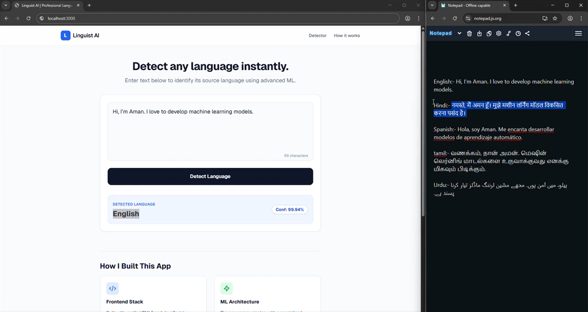

# Language Detection System

A powerful and efficient **Language Detection Model** that identifies the language of a given text input using Machine Learning / NLP techniques.



##  Features

- Detects 20+ languages with high accuracy  
- Trained on a **custom multilingual dataset** 
- Fast and efficient predictions 
- Clean and modular code structure  
- Ready for API or frontend integration  


## Tech Stack

- Python
- Machine Learning (Scikit-learn / NLP)  
- Pandas & NumPy  
- Flask / FastAPI


##  Installation Guide

Clone the Repository

```bash

git clone https://github.com/aman-devx/language-detech.git

cd language-detech

python -m venv venv

venv\Scripts\activate

pip install -r requirements.txt

python app/main.py

```
